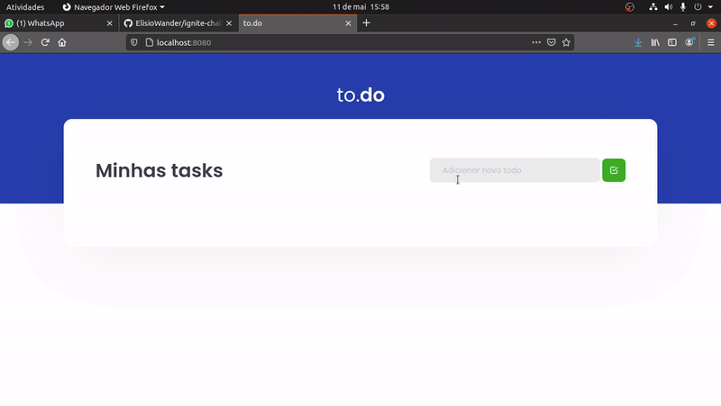

<h1 align="center">
    
</h1>

## 🏷️ Sobre 
**To.do** - Desafio do primeiro módulo do bootcamp da  🚀[Rocketseat](https://rocketseat.com.br/), Ignite. O template da aplicação estava pronto, o trabalho era criar as funcionalidades de um To.do List; criar uma tarefa, marcar a tarefa como feita, deletar uma tarefa. 

---

## 🛠️ Tecnologias utilizadas
Foram utilizadas as seguintes tecnologias para desenvolver a aplicação:

- HTML5
- CSS3
- React.js
- Typescript

---

## 🗂️ Como baixar e iniciar o projeto e 

```bash

    #clonar o projeto
    $ git clone https://github.com/ElisioWander/ignite-challenge-01.git

    #instalar as dependências
    $ yarn

    #iniciar a aplicação
    $ yarn dev
```
### Servidor local
localhost:8080

---

## Autor
### 👤 Elisio Wander

- Twitter: [@elisioWander](https://twitter.com/Elisio741)
- Linkedin: [@elisioWander](https://www.linkedin.com/in/elisio-wander-b88b69136/)
- github: [@elisioWander](https://github.com/ElisioWander)

---
## 📝 Licença
Copyright © 2020 [@ElisioWander](https://github.com/ElisioWander/ignite-challenge-01/blob/main/LICENSE)

Este projeto está sobe a [LICENÇA MIT](https://opensource.org/licenses/MIT)

---

### Desenvolvido 💜 by Elisio Wander
